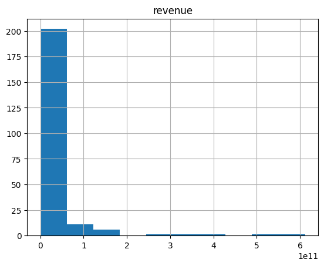
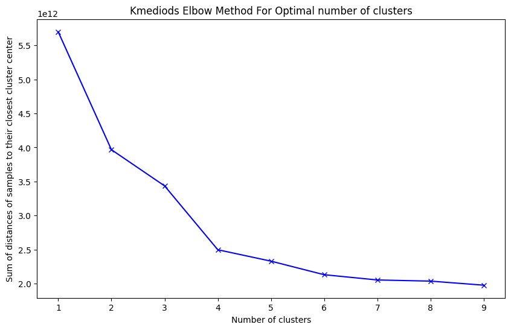
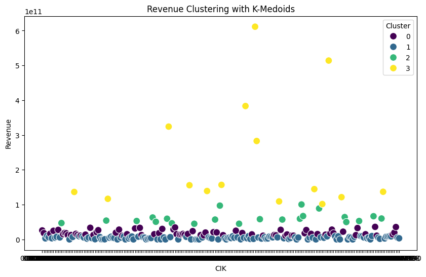

# Overview
In this assignment you will build a prototype of a cluster analysis tool to navigate financial statements.

Each company has a unique CIK (Central Index Key) that is used to identify it in the data. The CIK is a 10 digit number, and is the prefix of the file name for each company's 10-K report.

There are three main tasks in this assignment:
* To construct a CIK -> Company Name mapping from the provided data.
* To summarize each company's report into a few sentences.
* To cluster the companies into similar groups based on their financial statements.

The goal of this assignment is to demonstrate your ability to build a data pipeline to process unstructured data, and to use that data to build a simple clustering and summarizing tool whose output could be built into a more complex application. What we expect you to build are proofs of concept, and not production-ready models.

If you decide to use a paid API to solve the exercise, we will reimburse you for usage up to $10.

## Instructions
1. Clone (**please, don't fork!**) this repository and create a new branch for your development work
1. Create your implementation following the [Specification](#specification) below
1. Add instructions on how to run your implementation to the [Getting Started](#getting-started) section.
1. In the [follow-up questions](#follow-up-questions) section below, respond inline to each of the questions.
1. Commit your implementation and answers to a new repo in your personal GH and give `@avyfain` access to the repo.

**Guidelines:**
- Do not spend longer than four hours on your implementation, a perfect implementation is not required or expected. Please move on to the [follow-up questions](#follow-up-questions) after that.
- You may use any language or tools you like to complete this assignment. You can use any libraries or frameworks you like, including any existing clustering libraries. You can use any pre-trained language models you like.
- Ask questions if you have them. The business problem is intentionally vague, so you will need to make some assumptions. Document your assumptions in your code and in the follow-up questions.
- It's fine to use Google or StackOverflow to look up syntax or documentation. If you use ChatGPT or similar tools, please share the prompts you used in the follow-up questions.

## Exercise Data

You can find a zip file with the required data in [this HuggingFace repo](https://huggingface.co/datasets/inscopehq/SEC-10K).

In the provided data zip file, you will find over 3000+ recent 10-K reports from publicly traded companies. These reports are HTML containing the financial statements for each company.

If you have a CIK, you can use it to access the corresponding company's data in the SEC's EDGAR database. For example, the CIK for Apple Inc. is 0000320193. You can find Apple's reports here: https://www.sec.gov/edgar/browse/?CIK=000320193.

We do not expect you to download any additional data from the SEC's database, but you can find the full documentation for the EDGAR database here: https://www.sec.gov/edgar/searchedgar/accessing-edgar-data.htm

## Specification

We expect you to build the following functionality:
  - [x] You will filter down the dataset to cluster companies that are in the S&P 500 index. You can find a recent list of CIKs for companies in the S&P 500 in the `SP500.txt` file.
  - [x] You will create a script that given a directory with report files can produce a `CIK -> Company Name` mapping in the shape of a CSV file with two columns: CIK and Company Name. Each row in this file will represent each file in the provided data. (hint: you don't need to throw an LLM at this problem)
  - [x] You will run your mapping script on the provided data, and include it in your response.
  - [x] You will write a data pipeline to process the provided HTML into an intermediate representation that can be used for clustering. One of the features in your intermediate representation should be a 1-paragraph summary of the report. You can use any pre-trained language model you like to generate the summary.
  - [x] You will use your pipeline to assign every company in the dataset into similar groups based on their financial statements.
  - [x] You will provide a Jupyter Notebook, a Streamlit app, or equivalent for users to inspect and interact with the results of your clustering and summarization. The visualization should allow the user to select a company and show other similar companies in the same cluster.


## Getting Started

#### To run App
- clone repo and create a `venv`
- run `pip install ipywidgets pandas`
- on Command Line type `jupyter notebook` and open `main.ipynb` in browswer. You can also do this via vs code.
- Run the first code block and interact with the drop down. That's all!

#### To Reproduce results
- run `pip install -r requirements.txt` 
- Download file from Hugging face
- Create a local `.env` file in the root directory and populate with OPENAI_API_KEY = 'XXXX'
- run all in `clustering.ipynb` with correct function params for location of 10-K data 
  - note this will cost you openAI credits as it uses openAI to generate summaries
- to run mapping script:
```
from src.create_mapping import create_mapping_df 
mapping_df = create_mapping_df('data') # data is location of HF data
```

## Follow-Up Questions

  1. Describe which task you found most difficult in the implementation, and why.
Filtering down what to send to the LLM to create a summary since 10-Ks are all around 100. I utilized ChatGPT to quickly help me understand 10-Ks [interaction](https://chat.openai.com/share/ec24cd6f-2153-46a0-8c05-831583d14bf9). Once I started interacating with OpenAI I used gpt-4 initially and ran into rate limiting as I was using my personal account. I was used to an enterprise account with much higher rate limits.
  2. What led you to choose the libraries or frameworks you used in your implementation?
   For my implementation, I selected Langchain because it facilitates the loading of HTML documents and enables interaction with OpenAI's language models. Langchain was my choice due to its comprehensive suite of tools that span the entire spectrum of working with Large Language Models (LLMs). Additionally, the ease of creating LLM pipelines with Langchain Expression Language (LCEL) was a significant factor. I opted for OpenAI's solutions as I currently don't have access to the Claude API, which would have been beneficial for handling extensive documents.
  3. How did you evaluate whether the clusters and summaries created by your system were good or not?
  
  ### Clusters
  I formed the clusters primarily focusing on the revenue metric(extracted from 10-K via LLM), which meant our clustering was based on a single numerical dimension. The choice to use K-medoids was influenced by the data's pronounced skew towards the higher end, as illustrated in the following histogram:
  


  To determine the optimal number of clusters, I utilized an elbow graph. This approach helped in identifying the inflection point for a distinct number of clusters by examining the inertia_ attribute. After analysis, it was concluded that 4 clusters were most suitable:

  The final clustering result is shown below. The clear demarcation between the groups is evident:

  ### Summaries
  I only tested one due to time constraints, I tested a [CEO's letter](https://sterisplc.gcs-web.com/static-files/3955064a-1e3c-467d-b089-870061aaaaa6 ) vs my summary and asked the LLM for a score out of 10. I tested Steris plc, CIK 0001757898. Since we only send Item 7 to the LLM, the summary was not the best. LLM evaluation:
  
  >The CEO's letter summary highlights the achievements and growth of STERIS in fiscal year 2022. The CEO expresses gratitude towards the employees and acknowledges their contributions to the company's success. The letter emphasizes the higher-than-expected revenue growth, driven by various segments of the business. It also mentions the improvement in operating margins and adjusted earnings per diluted share. The CEO discusses the company's plans for the future, including investments in research and development and global projects. The tone of the letter is positive, optimistic, and appreciative.\n\nOn the other hand, the 10-K report summary provides limited information, only mentioning the total revenue reported by STERIS Corporation without any further details. It lacks the comprehensive overview of the company's performance and future plans that the CEO's letter provides. The tone of the 10-K report summary is neutral and factual.\n\nIn terms of content, the CEO's letter focuses on the company's achievements, growth, and future prospects, while the 10-K report summary only provides a brief mention of the total revenue. The CEO's letter emphasizes the outperformance of different segments, cost synergy targets, and the company's ability to meet customer needs. The 10-K report summary, however, does not provide any specific information about these aspects.\n\nIn comparing the two summaries, it is evident that the CEO's letter provides a more detailed and comprehensive overview of STERIS's performance and future plans. It conveys a positive and optimistic tone, highlighting the company's achievements and growth. The 10-K report summary, on the other hand, lacks specific details and focuses solely on the total revenue figure.\n\nBased on the limited information provided, it is difficult to accurately assess the accuracy of the 10-K report summary. However, given its brevity and lack of specific details, it may not accurately capture the full picture of STERIS's financial performance and other key aspects. Therefore, I would rate the accuracy of the 10-K report summary as 5 out of 10.


  ### Revenue
  I pulled 5 annual revenues from the internet and compared them to what the LLM extracted. Whenever a revenue was pulled we were correct!
    
  * [Motorla Solutions, Inc.](https://www.google.com/search?q=MOTOROLA+SOLUTIONS,+INC.+revenue+2022&sca_esv=598681343&sxsrf=ACQVn09BrYDNFQMiAI3p8sdyLpNdmHdiHA:1705379269800&ei=xQWmZbfCMLLi0PEPqO-P2Ak&ved=0ahUKEwj3uNXsiOGDAxUyMTQIHaj3A5sQ4dUDCBE&uact=5&oq=MOTOROLA+SOLUTIONS,+INC.+revenue+2022&gs_lp=Egxnd3Mtd2l6LXNlcnAiJU1PVE9ST0xBIFNPTFVUSU9OUywgSU5DLiByZXZlbnVlIDIwMjIyCBAAGIAEGKIEMggQABiABBiiBDIIEAAYiQUYogRI_rEHUPupB1iDrwdwCHgBkAEAmAGcAaAB-AGqAQMxLjG4AQPIAQD4AQL4AQHCAgoQABhHGNYEGLADwgIIECEYoAEYwwTiAwQYACBBiAYBkAYI&sclient=gws-wiz-serp)
    
  * [DTE Energy Inc](https://www.google.com/search?q=dte+energy+inc+revenue+2022&sca_esv=598681343&sxsrf=ACQVn0_1SbQTyISanht__YwIQUr-0UdEEg:1705379472154&ei=kAamZfeACZPE0PEPk5eU2Ak&oq=DTE+Engery+revenue+2022&gs_lp=Egxnd3Mtd2l6LXNlcnAiF0RURSBFbmdlcnkgcmV2ZW51ZSAyMDIyKgIIADIMECEYChigARjDBBgKMgwQIRgKGKABGMMEGApIqWZQyBFYwltwBHgBkAEAmAGOAaABnQmqAQQxMy4xuAEDyAEA-AEC-AEBwgIHECMYsAMYJ8ICChAAGEcY1gQYsAPCAgYQABgHGB7CAgcQABiABBgNwgIGEAAYHhgNwgIIEAAYBRgeGA3CAgsQABiABBiKBRiGA8ICBBAAGB7CAgoQIRgKGKABGMME4gMEGAAgQYgGAZAGCQ&sclient=gws-wiz-serp)
    
  * [ADP](https://www.google.com/search?q=ADP+revenue+2023&sca_esv=598932482&sxsrf=ACQVn0_9II63_ROp6BCoacVsOsUQ01QgGg:1705448069343&ei=hRKnZbDLFMP00PEPvaSusAE&ved=0ahUKEwjwoeySieODAxVDOjQIHT2SCxYQ4dUDCBA&uact=5&oq=ADP+revenue+2023&gs_lp=Egxnd3Mtd2l6LXNlcnAiEEFEUCByZXZlbnVlIDIwMjMyBRAAGIAEMgsQABiABBiKBRiGAzILEAAYgAQYigUYhgMyCxAAGIAEGIoFGIYDSJKtAVDLogFY26kBcAZ4AZABAJgBqwGgAckCqgEDMi4xuAEDyAEA-AEBwgIKEAAYRxjWBBiwA8ICBhAAGAcYHuIDBBgAIEGIBgGQBgc&sclient=gws-wiz-serp)
    
  * [Monster Energy drink](https://www.google.com/search?q=MONSTER+BEVERAGE+CORPORATION+revenue+2022&sca_esv=598932482&sxsrf=ACQVn0_acio_6DpyT4caJ4g8feXpsN-kdg:1705447744972&ei=QBGnZaj3Opmx0PEPk_G64AI&ved=0ahUKEwiol5b4h-ODAxWZGDQIHZO4DiwQ4dUDCBA&uact=5&oq=MONSTER+BEVERAGE+CORPORATION+revenue+2022&gs_lp=Egxnd3Mtd2l6LXNlcnAiKU1PTlNURVIgQkVWRVJBR0UgQ09SUE9SQVRJT04gcmV2ZW51ZSAyMDIyMgQQIxgnSIcGUABYAHAAeAGQAQCYAWigAWiqAQMwLjG4AQPIAQD4AQHiAwQYACBB&sclient=gws-wiz-serp)
    
  * [Jacob Solutions Inc](https://www.google.com/search?q=Jacobs+Solutions+Inc.+revenue+2023&sca_esv=598932482&sxsrf=ACQVn09iy0lxBNFnkhGYerMTzkM7G9Zzrg:1705447810790&ei=ghGnZd3dL4bY0PEPmr6V8Ac&ved=0ahUKEwjdpseXiOODAxUGLDQIHRpfBX4Q4dUDCBA&uact=5&oq=Jacobs+Solutions+Inc.+revenue+2023&gs_lp=Egxnd3Mtd2l6LXNlcnAiIkphY29icyBTb2x1dGlvbnMgSW5jLiByZXZlbnVlIDIwMjMyBRAhGKABMgUQIRigAUiaCFD4BFiXB3ABeAGQAQCYAXWgAc4BqgEDMS4xuAEDyAEA-AEBwgIKEAAYRxjWBBiwA8ICBBAjGCfiAwQYACBBiAYBkAYI&sclient=gws-wiz-serp)

  4. If there were no time or budget restrictions for this exercise, what improvements would you make in the following areas:
      - Implementation
        
        Implement an embedding framework to enhance the Large Language Model (LLM) capabilities, particularly for generating summaries and extracting revenue data, by integrating Retriever-Augmented Generation (RAG). I also could look into different text splitters for chunking.
      
      - User Experience:
      
        Aim to display the summaries in their entirety for better user comprehension. Additionally, introduce a graphical representation to compare a specific CIK with others, enriching the visual appeal and informational value.
      
      - Data Quality
        
        Refine the regex used for extracting Item 7 to increase precision. Ensure completeness and accuracy of all summaries and revenue data. Accuracy could be achieved by: validating against a verified, labeled training set for both aspects. For verifying summaries, consider using the embedding framework to compare the summary's content with the entire 10-K document, ensuring a high level of similarity. Another approach could involve prompting the LLM to specify the exact portions of the document that informed each part of the summary.

  5. If you built this using classic ML models, how would approach it if you had to build it with LLMs? Similarly, if you used LLMs, what are some things you would try if you had to build it with classic ML models?
   
My methodology incorporated a hybrid approach, utilizing both Large Language Models (LLMs) and traditional Machine Learning (ML) models. The LLMs were primarily employed for extracting pertinent information from the documents, while the ML models were leveraged for clustering purposes. If integrating more aspects of one approach into the other, I believe the key addition would be an embedding framework, as previously mentioned. Given the extensive length of the documents, a sophisticated method to pre-filter the text before it reaches the LLMs could greatly enhance both the precision of the output and cost-efficiency (by reducing the number of tokens processed).
  
  6. If you had to build this as part of a production system, providing an inference API for previously unseen reports, how would you do it? What would you change in your implementation?
  
  In a production environment, handling new reports through an inference API would involve a series of systematic steps. Initially, each report would undergo a filtering phase to determine the appropriate text to forward to the LLM. Following this, we would extract the summary and revenue data from the LLM's output.
  The next crucial step is assigning a cluster to this new report. This process would be twofold: Firstly, we would assign a provisional cluster based on the current medians of existing clusters, ensuring consistency in the user experience as these medians are less susceptible to outliers. Secondly, we would reevaluate the entire clustering to ascertain if any adjustments are necessary, based on a predefined heuristic. However, given the median-based approach, significant changes in the clusters or their numbers are unlikely.
  Ultimately, the inference API would provide one of two responses: the assigned cluster for the new report or an entirely updated set of clusters. The choice of response depends on certain criteria and is relatively straightforward to handle. Additionally, to enhance future efficiency, we would store the LLM's responses, potentially reducing future token usage.
  When the API is invoked, it would receive a comprehensive dataset comprising CIK, revenue(unless we have db access), associated cluster, and the full 10-K document. This complete dataset ensures a thorough and accurate clustering process.


# Evaluation Criteria

You will be evaluated out of a total of 50 points based on the following criteria.

  - Learning Exercise (30 points total)
    - **Functionality (20 points)**: is the requested functionality implemented as described?
    - **Code Quality (10 points)**: is the code well structured and easily read?
    - **Bonus (3 maximum)**: bonus points are awarded for anything that goes above and beyond the items in the specification.  For example, additional .
  - Follow Up Questions (20 points total)
    - Question 1 (2 points)
    - Question 2 (2 points)
    - Question 3 (3 points)
    - Question 4 (3 points)
    - Question 5 (5 points)
    - Question 6 (5 points)
